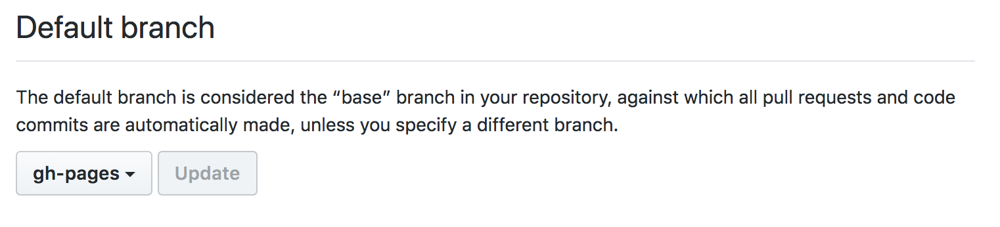

Tech blog using Jekyll engine, published on Github pages.

## Writing
### Test locally
+ Write a post under \_posts following the naming convention
+ `bundle exec jekyll serve` (check incremental builds, autogeneration)
+ Navigate to localhost:4000/tech-blog/ # baseurl in \_config.yml

### Production
+ Just push to gh_pages branch

## Setup
### Resources
+ [Jekyll for Github pages](https://jekyllrb.com/docs/github-pages/)
+ Vice versa: [Github pages for Jekyll](https://help.github.com/articles/using-jekyll-as-a-static-site-generator-with-github-pages/)

### Github pages
+ Regarding repos/branches: You can use Pages once per user/organisation (special repository named "spygi.github.io", master branch)
or per project (/docs folder in master or special "gh-pages" branch).
This repo is using the last method with the "gh-pages" branch. To avoid confusion I deleted the master branch (locally and remotely). For convenience I set the gh-pages as the default upstream to push to.

+ [Serving through Github pages](https://help.github.com/articles/configuring-a-publishing-source-for-github-pages/#default-source-settings-for-repositories-without-the-username-naming-scheme) 

+ Optional for PRs/when navigating to the Web UI of Github:

### Credits
Initial inspiration by [Laurent Pellegrino's blog](http://www.pellegrino.link/) and [Marco's](http://mziccard.me/) though neither of the the 2 worked out of the box for me: Laurent's worked locally but when pushing on Github.io, CSS and other static assets where not linked correctly (tried various combinations of base_url and relative_url but then linking of the pages would not work) and Marco used the special user repo method which I want to keep free for other stuff.
